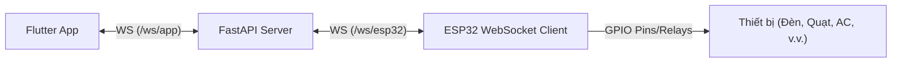

# 1. Báo cáo: Kiến trúc & Sơ đồ Hệ thống

Ngày: 2026-05-20

Tóm tắt
- Hệ thống gồm 3 thành phần: `Flutter App` (client trên mobile), `Server` (FastAPI) và `ESP32` (thiết bị). Giao tiếp giữa `ESP32` ↔ `Server` ↔ `Flutter App` đều dùng **WebSocket** cho realtime bidirectional communication.

Thực trạng (evidence)
- `Server` cung cấp WebSocket endpoint cho ESP32: xem [server/main.py](server/main.py#L290) (`@app.websocket("/ws/esp32")`) và biến toàn cục `esp32_ws_client` để giữ kết nối.
- `Server` cung cấp WebSocket endpoint cho Flutter App: xem [server/main.py](server/main.py#L315) (`@app.websocket("/ws/app")`) và list `app_ws_clients` để quản lý nhiều client.
- `ESP32` client dùng `WebSocketsClient` kết nối tới `/ws/esp32`: xem [esp32_client/esp32_client.ino](esp32_client/esp32_client.ino#L820-L827).
- `Flutter App` dùng WebSocket client (package `web_socket_channel`) để giao tiếp realtime với server.

Sơ đồ vận hành (hiện trạng)

Phân tích ngắn
- Lý do thiết kế hiện tại: WebSocket cho cả 2 thành phần cho phép giao tiếp realtime, bidirectional, và giảm latency. Luồng hoạt động:
  1. **ESP32 ← Server**: Nhận dữ liệu cảm biến (PIR, light, gas, temp, humidity) qua WebSocket → broadcast tới tất cả Flutter clients
  2. **App → Server ← ESP32**: Flutter App gửi lệnh điều khiển (set_state) via WebSocket → Server forward sang ESP32 → **ESP32 thực thi qua GPIO pins** (điều khiển relay/transistor bật/tắt đèn, quạt, v.v.)
  3. **Logging**: Server lưu trữ logs/events dưới dạng JSONL cho audit trail
- Lợi ích: realtime state sync, low latency, bidirectional push notifications

Rủi ro & Giới hạn
- Server hiện dùng biến toàn cục `esp32_ws_client` (single ESP32 connection). Để mở rộng hỗ trợ nhiều thiết bị, cần refactor thành device registry (Map hoặc Redis).
- Kết nối WebSocket chưa được mã hóa (WSS) và không có auth mechanism cho WS.

Khuyến nghị
1. **Ngắn hạn**: Hiện tại đã optimize code (xóa unused endpoints, constants-driven config). Tiếp theo là bổ sung error handling cho WebSocket reconnection.
2. **Trung hạn**: Triển khai WSS (TLS) + JWT auth cho WebSocket; refactor `esp32_ws_client` thành multi-device registry.
3. **Dài hạn**: Khi scale: dùng Redis Pub/Sub để điều phối giữa nhiều server instances, implement message queue cho commands.

