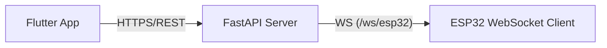

# 1. Báo cáo: Kiến trúc & Sơ đồ Hệ thống

Ngày: 2026-05-20

Tóm tắt
- Hệ thống gồm 3 thành phần: `Flutter App` (client trên mobile), `Server` (FastAPI) và `ESP32` (thiết bị). Hiện trạng cho thấy giao tiếp thực tế giữa `ESP32` và `Server` dùng WebSocket, còn `Flutter App` giao tiếp với `Server` bằng HTTP REST.

Thực trạng (evidence)
- `Server` cung cấp WebSocket endpoint cho ESP32: xem [server/main.py](server/main.py#L264-L277) (`@app.websocket("/ws/esp32")`) và biến toàn cục `esp32_ws_client` để giữ kết nối.
- `ESP32` client dùng `WebSocketsClient` kết nối tới `/ws/esp32`: xem [esp32_client/esp32_client.ino](esp32_client/esp32_client.ino#L820-L827).
- `Flutter App` hiện dùng REST client: xem [smarthomeapp/lib/services/esp32_client.dart](smarthomeapp/lib/services/esp32_client.dart) (`GET /devices`, `POST /devices/{id}/state`, `GET /logs`).

Sơ đồ vận hành (hiện trạng)

Phân tích ngắn
- Lý do thiết kế hiện tại: REST cho client đơn giản, dễ debug và phù hợp cho các tác vụ non-realtime (auth, upload, điều khiển có phản hồi). WebSocket dành cho ESP32 cho phép telemetry và lệnh thời gian thực.
- Hệ quả: App không nhận push từ thiết bị; để có realtime cần mở rộng Server để hỗ trợ WSS cho client hoặc dùng polling trên App.

Rủi ro & Giới hạn
- Server hiện dùng biến toàn cục `esp32_ws_client` (single connection). Không hỗ trợ nhiều thiết bị đồng thời.
- Kết nối WebSocket chưa được mã hóa (server log in ra `ws://...`) và không có auth cho WS.

Khuyến nghị
1. Nếu muốn realtime cho App: thêm endpoint WSS cho client (ví dụ `/ws/app`), áp dụng TLS và auth (JWT). 2. Nếu giữ đơn giản: sử dụng polling cho App (khuyến nghị 5–15s) và giữ WebSocket cho ESP32. 3. Khi scale: lưu mapping `deviceId -> connection` (Redis), dùng Pub/Sub để điều phối giữa các instance.

Bước hành động tiếp theo (ngắn)
- Quyết định: giữ hybrid (REST+WS) hay chuyển toàn WSS cho App. Nếu chọn WSS, tôi có thể tạo mẫu endpoint WSS + snippet Flutter.

